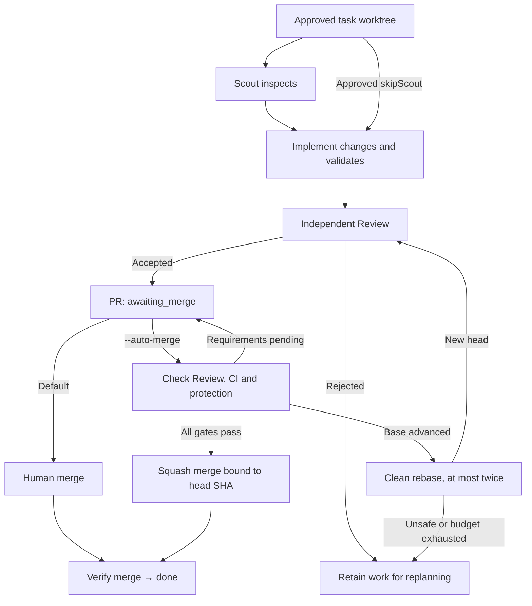

# Roc detailed guide

[Quick start](README.md) · [繁體中文詳細指南](README.details.zh-HK.md)

## Architecture: GitHub tasks and one executor

GitHub Issues hold approved task specifications and execution checkpoints.
The daemon saves attempts, model choices, usage, role results and PR receipts
in one comment per Issue owned by its GitHub account. Labels show status; they
do not lock tasks or grant execution permission.

[Open the interactive architecture map](output/archify/roc-current/roc-architecture.html), authored in English with source links for the current architecture. Download the HTML and open it locally; GitHub displays its source.


Planning and execution can share one machine. The roles in the diagram do not require two Macs.

The daemon runs two independent Issues by default, configurable up to eight. Each task has its own retained worktree at
`<project>.agile-worktrees/issue-<number>` and branch `agile/issue-<number>`.
No task database is created. Local files hold configuration, worktrees, locks,
diagnostic logs and Pi sessions. Guarded automatic PR merge is opt-in, with at
most two clean base refresh/re-review cycles per task. Superset is deferred.

### Context compaction

Roc uses Pi's built-in auto-compaction. It is enabled by default unless disabled
in Pi's user settings. Near the model's context limit, Pi summarizes older
messages and keeps recent messages for subsequent requests.

Scout, Implement, and Review each use a separate Pi session. Compaction applies
within that session. GitHub Issues retain task specifications and execution
checkpoints; local Pi session files retain conversation history. Roc does not
add a second compaction mechanism.

See [Pi's compaction documentation](https://github.com/earendil-works/pi/blob/main/packages/coding-agent/docs/compaction.md)
for triggers, retained context, and the `compaction` settings.

### Validation status

M1–M4 are complete for the revised scope. Use this checkout's `src/cli/main.ts`
through `ROC_CLI_ENTRY` in each terminal for the behavior described here.

| Scope | Evidence |
| --- | --- |
| GitHub tasks, worktrees, parallel execution and recovery | [M1/M2 live acceptance](docs/validation/m1-m2-live-2026-09-09.md) |
| Automatic merge, base refresh and fresh Review | [M3 protected-branch acceptance](docs/validation/m3-live-2026-09-09.md) |
| Diagnostics, progress, timing, usage and comparisons | [M4 measurements](docs/validation/m4-live-2026-09-09.md), with 292 local tests passing |

A separate [mixed-effort live check](docs/validation/role-routing-live-2026-09-09.md)
confirmed Astra `high` Scout/Review and `medium` Implement through Pi state readback.
Its traced repeat merged both PRs; an unexplained first-run refresh cancellation
remains open in [#79](https://github.com/devos-ing/Roc/issues/79).

For one fixed pair of small tasks, successful runs took 8m31s / 67,722 tokens
sequentially, 6m47s / 67,615 tokens in parallel, and 5m4s / 52,925 tokens in
parallel with Scout omitted. The last mode also hit a startup timeout; including
manual recovery, its observed trial took 12m38s. A preflight read retry was added
afterward. This small sample is not a general speed or cost guarantee. Cached
input is already included in input tokens. These runs used `high` for every role
and predate the current Scout/Review `high`, Implement `medium` policy.

Claude/GLM have not passed equivalent live acceptance. [Physical two-host acceptance #56](https://github.com/devos-ing/Roc/issues/56)
is deferred and does not block this stage. Superset is outside this stage.
Historical SQLite/stub results are not evidence for the current workflow.

## Roc daemon setup

Start with planning and execution in one project clone on one machine. If you
later separate the machines, clone the same GitHub repository on each and run
a daemon only on the execution host. Physical two-host acceptance is deferred.

On the planning machine, authenticate GitHub CLI, use `roc-create-tasks`, and
approve the plan. The skill publishes its approved manifest with:

```bash
bun "$ROC_CLI_ENTRY" task publish-github .agile/backlog/approved.json
```

Publication reconciles task identities before adding exact approval comments
and `roc:ready`. The manifest is publication input, not a local queue. The
planning machine can go offline after publication.

The execution machine needs Bun 1.3+, Node.js 22.19+, Git, GitHub CLI, the Roc
checkout with `bun install` completed, and the project's build/test tools.
Enter its project clone and run:

```bash
export ROC_CLI_ENTRY=/absolute/path/to/Roc/src/cli/main.ts
gh auth login
bun "$ROC_CLI_ENTRY" onboard
export ROC_GITHUB_PUBLISHERS=your-publisher-login
bun "$ROC_CLI_ENTRY" scheduler run --base-branch main
```

`ROC_GITHUB_PUBLISHERS` accepts comma-separated trusted GitHub logins and defaults
to the current `gh` account. The executor defaults to that account too;
`ROC_GITHUB_EXECUTOR` can name it explicitly. Read-only clients using a different
account must set it to the daemon's login to read the same owned checkpoints.
The daemon itself must authenticate as that executor.

The target defaults to the GitHub repository's default branch if omitted.
`--source github` is optional because GitHub is the only task source.
`--once` processes one eligible task and exits. Continuous mode polls every
30 seconds for remote changes while idle or running. GitHub read failures stop the invocation; a service manager
can restart it after connectivity returns. Unknown checkpoint writes retain the
ownership lock until reconciled.

### Optional automatic PR merge

Manual merge is the default. To merge independently reviewed PRs automatically:

```bash
bun "$ROC_CLI_ENTRY" scheduler run --base-branch main --auto-merge
```

Configure **classic branch protection** on the target with at least one required
status check, **Require branches to be up to date before merging**, and enforcement
for administrators (**Do not allow bypassing the above settings**). Squash merging
must be enabled. Roc never modifies protection, uses an administrator bypass, or
pushes directly to the target. GitHub's merge API accepts the expected head SHA,
not a base SHA condition; strict server protection guards the final base race.

The executor needs Issue/comment write access, PR read/write and contents write
access for publication/merge, plus checks, commit statuses and branch
protection/active repository and organization rules read access. Missing or
unreadable protection/rules (including private repositories without rules API
access) block merge visibly. Human GitHub reviews remain required when configured;
Pi Review does not replace them. Every reported check/status must succeed on the
exact reviewed head, including configured app identities for required checks.
Skipped, neutral, pending or failed results wait. Merge queues and unsupported
active rules also wait; Roc does not bypass them.

Only managed, still-open, exactly approved Issues with persisted successful
independent Review evidence can auto-merge. Pending requirements stay
`awaiting_merge` with a readable reason, without rerunning agents or rewriting
identical checkpoints every 30 seconds. Changed external heads, closed-unmerged
PRs or missing Review evidence (including legacy accepted records) require replan.

If the target advances, Roc allows **at most two clean rebase/re-review cycles**
per task, with the budget preserved across restarts. It checkpoints intent before
Git mutation, verifies the retained clean task worktree has exactly its trusted
commit and expected remote head, then rebases the same patch onto the freshly
fetched target. Only the task branch is pushed, with an explicit expected-old-head
force-with-lease. Conflicts abort to the original work. Dirty files, unexpected
history, external head changes, ambiguous pushes or an exhausted budget require
`needs_replan`, without discarding work. Old commits remain under
`refs/agile-refresh/` for inspection.

A confirmed refresh starts a **new independent Pi Review** of the exact rewritten
head/base, including the approved validation commands. The original specification,
Implement output, historical attempts and usage stay intact; a Git-only rebase
is not an Implement/model attempt. Fresh Review records its actual model, effort
and usage. Rejection requires replan; acceptance waits for CI on the new head
before all merge guards are checked again. A confirmed refresh can resume its
Review after restart, but an interrupted intent without a confirmed result must
be reconciled explicitly, never blindly rerun.

Refresh, fresh Review and merge decisions are serialized even with `--concurrency 2`.
Shutdown drains selector-owned Git/Review work as well as workers; uncertain
cleanup or checkpoint writes retain the ownership lock. Roc reads back the
PR after every merge response, including lost responses, then fetches the target
and verifies merge ancestry before saving `done` and releasing dependencies.
`--once` can reconcile already published PRs but does not keep waiting for newly
published CI; use continuous mode for automatic completion. Automatic merge has
deterministic transport/Fake Harness tests, including refresh/re-review, and
real-Git conflict/lease tests. [Live protected-branch acceptance](docs/validation/m3-live-2026-09-09.md)
also passed for two parallel tasks, including one rebase, fresh independent
Review and CI before automatic merge. That test used one Mac.

### Issue closure

Published PRs include a plain Issue link, not an automatic-closing keyword.
After a manual or automatic merge, Roc verifies the recorded PR head and merge
commit in the configured target branch, confirms the `done` checkpoint by
reading it back, then closes the still-open Issue as completed. Non-default
`--base-branch` targets work too. Closure rechecks the exact checkpoint,
approved specification, complete plan and merge evidence.

If closure fails, `done` stays intact and polling or restart retries closure
without rerunning models. Admitted done tasks also repair stale status labels,
even when the Issue is already closed; a failed label write does not block
closure. Candidates rejected by admission trigger neither label repair nor
closure checks or writes.

[Live closure and restart validation](docs/validation/issue-closure-live-2026-09-09.md)
confirmed real GitHub closure on a non-default branch, including recovery without
model replay. The report also records two interrupted attempts and the use of
single-run execution for the successful tasks.

### Parallel admission

The default is `--concurrency 2`; choose an integer from `1` through `8`.
Use `--concurrency 1` to serialize execution.
When one task finishes, its slot can start another without waiting for a slower
task. `--once` still processes only one task. The board shows all running Issues,
and terminal events include their task IDs.

Only disjoint literal path scopes can overlap. For example, `src/auth/` overlaps
`src/auth/login.ts`, but not `src/billing.ts`. Comparison ignores case for macOS.
Root scopes, globs, prose, paths outside the repository and tasks with hooks run
alone. Include shared-resource constraints in the approved scope, such as
`TCP port 3000`, to keep that task exclusive. This admission rule cannot detect
undeclared shared resources or confine an agent's filesystem access.

Dependencies still wait for merged PRs. Closing an active Issue or withdrawing
approval requests cancellation at the next poll. Confirmed task-local failure
or cancellation records attention without stopping its sibling. Pi child exit
must be confirmed before a role completes or a worker releases its slot.
Unconfirmed cleanup or checkpoint writes stop admission and retain the daemon
lock. Global `Ctrl-C` cancels every active task.

Before cancelling because of a negative poll result, Roc directly reads the
Issue and its known plan members and revalidates their authority. A temporary
list omission therefore does not cancel approved work. Normal polls add no
extra reads. Failed confirmation stops safely with `GITHUB_AUTHORITY_UNCONFIRMED`;
cancellation records include the specific reason.
[Polling regression evidence](docs/validation/polling-authority-2026-09-09.md)
covers workers, refreshed Review, and genuine withdrawal or closure.

### Optional Scout omission

For a sufficiently specified low-risk task, the approved manifest can set
`skipScout: true` to run Implement and independent Review directly. This is off
by default. The scope must contain explicit relative file paths with suffixes,
without whitespace, traversal or glob syntax; acceptance and validation remain
required. Use the normal Scout flow for broader or uncertain work. The board
shows Scout as skipped, and a later base refresh still requires a fresh Review.
See the [M4 measurements and limitations](docs/validation/m4-live-2026-09-09.md).

### Progress and recovery

For failed work, inspect `scheduler inspect` and `.agile/runtime/agile.log` on
the execution host. Safe error codes identify GitHub reads, uncertain writes,
the affected Issue, attempt and phase. Check the retained task worktree before
starting replacement work. A verified existing commit can be supplied as
`sourceCommit` in a new approved task; preserve the original failed checkpoint
and review the replacement task's scope and dependencies. Never remove a retained
ownership lock until its processes and uncertain remote writes are reconciled.
A timed-out repository lookup during startup gets one read-only retry before
any task starts; a second failure reports `GITHUB_REPOSITORY_UNAVAILABLE`.

When GitHub reports a rate limit, the daemon pauses GitHub requests and retries
reads after `Retry-After` or the quota reset time. Workers share this pause. If
GitHub supplies neither deadline, retries start after one minute and back off
to at most fifteen minutes between attempts. Ctrl-C interrupts the wait.
See [GitHub's rate-limit guidance](https://docs.github.com/en/rest/using-the-rest-api/best-practices-for-using-the-rest-api#handle-rate-limit-errors-appropriately).

A transient failure of the daemon's scheduled task-list read no longer stops a
long-running `scheduler run`. When a poll fails with a retryable infra error
such as a network timeout, the daemon logs a warning naming the error code, the
consecutive-failure count and the next delay, then keeps running and skips
admission until a fresh read succeeds; in-flight workers are unaffected. The
wait starts at 30 seconds, doubles after each consecutive failure up to five
minutes, and resets to 30 seconds after one successful poll. Failures marked
non-retryable still report an error and exit through the normal failure path;
Ctrl-C keeps its immediate graceful stop.

Permission failures still report an error. Mutating commands are not blindly
replayed: checkpoint and PR writes keep their existing readback checks, and
unconfirmed writes or child cleanup can still retain the ownership lock.

`task board` details show elapsed time, time in agent attempts, merge waiting and
partial token usage. `scheduler inspect` includes the phase-duration breakdown.
Recent actions are GitHub checkpoint summaries, refreshed at phase boundaries
and at most every 30 seconds of tool activity; watch daemon output for individual
live actions. Historical records without timing, or closed/changed Issues whose
stop has not been reconciled, show unavailable timing rather than zero.

#### Repairing Roc settings

`ROC_SETTINGS_INVALID` names the Roc settings location, normally
`~/.config/roc/settings.json`, and distinguishes missing files, invalid JSON,
unsupported fields, invalid cycle/settings data, and read failures.

- **Missing file:** run `npx roc-it@latest onboard` under the intended OS account.
- **Cannot read:** check that the named path is a regular file, its ownership and
  read permissions, and access to its parent directories. Fix access for the
  intended account; do not make credentials or settings world-readable.
- **Invalid content:** back up the exact file before editing it locally. For
  example, `cp -ip ~/.config/roc/settings.json ~/.config/roc/settings.json.bak`
  preserves permissions and asks before overwriting an existing backup; choose
  another backup name if one already exists. Keep backups private and do not
  paste settings or credentials into Issues or logs.

Repair JSON syntax first, then review unsupported fields and invalid data against
this version's format. The minimal weekly configuration is
`{"cycle":{"type":"weekly"}}`; daily uses `"daily"`, and custom uses
`{"cycle":{"type":"custom","days":14,"anchorDate":"2026-08-28"}}` with positive
whole days and a real `YYYY-MM-DD` calendar date. Optional `skills.allowlist` is an
array of `{ "name": "…", "source": "…" }` identities with nonempty strings;
`execution.allowUnsandboxed` is a boolean. Optional top-level `models` supports
only `luna`, `terra` and `sol`, each a `provider/modelId` string as described below.
Do not remove a valid `models` mapping. Other fields, including nested extras,
are rejected; review and manually correct misplaced/unsupported fields rather
than blindly deleting them or replacing the entire file with the minimal example.
Diagnostics show at most three fixed public field names and a count for hidden
names, never arbitrary unknown names or configuration values.

Roc does not rewrite invalid files, and **onboarding reads the same file and
cannot repair it**. After manual repair, retry the failed command (for example,
`npx roc-it@latest task board`). These are Roc settings, not Pi's separate
`~/.pi/agent/settings.json` or `~/.pi/agent/auth.json`; leave credentials untouched.

### Pi provider setup

Onboarding reuses Pi credentials or opens ChatGPT browser authorization. Follow
the displayed URL and callback instructions. Keep callback URLs and credentials
out of Issues. Roc tests one small request before saving settings; failed or
cancelled login leaves prior settings unchanged.

New Codex setups select `gpt-6-astra` with `high` reasoning. An explicitly saved
Codex model is preserved. Pi settings and credentials live in
`~/.pi/agent/settings.json` and `~/.pi/agent/auth.json`, or the directory selected
by `PI_CODING_AGENT_DIR`. Roc settings live in `~/.config/roc/settings.json`.
Use the same OS account for onboarding and the daemon.

Optional `models.luna`, `models.terra` and `models.sol` map Scout, Implement and
Review profiles to exact Pi `provider/modelId` values. Omitted profiles use the
Pi default. Configured models must exist in the catalog and support `high`.
New Scout and Review attempts use `high`; Implement uses `medium` across risk
levels and retries. High-risk tasks retain the Sol profile; unsupported efforts
become `needs_replan`.
Each role gets at most three attempts. A first retry normally keeps its profile;
model unavailability or the final retry can advance the profile. Existing
attempts keep their recorded model and effort on restart.

For GPT-6 Astra across all roles, merge this field into existing Roc settings.
The role routing applies `high` to Scout/Review and `medium` to Implement:

```json
"models": {
  "luna": "openai-codex/gpt-6-astra",
  "terra": "openai-codex/gpt-6-astra",
  "sol": "openai-codex/gpt-6-astra"
}
```

An optional `efforts` object overrides the per-role reasoning defaults —
Scout `high`, Implement `medium`, Review `high` — with `medium`, `high`, or
`xhigh`:

```json
"efforts": {
  "implement": "xhigh",
  "scout": "medium"
}
```

Omitted roles keep the defaults, and existing attempts keep their recorded
effort on restart. A configured effort the routed models do not support
falls back to the role default with a diagnostic instead of failing the run;
when only a stronger fallback model supports it, routing advances along the
normal profile chain (for example Implement moves from Terra to Sol for
`xhigh`). Raise effort for hard implementation work and lower it for cheap
scouting when your provider and workload justify it.

For advanced Claude or GLM setup, configure the bundled Pi CLI under the daemon
account with `bun x --no-install pi`. Use its `/login` and `/model` commands where
supported and save the default. Provider keys must be in the daemon environment.
Rerunning Roc onboarding selects Codex again.

Onboarding records permission to execute coding tools once. Automation can set
`ROC_ALLOW_UNSANDBOXED=1` explicitly. Pi runs with its OS account's permissions;
a worktree is not a filesystem sandbox. Use OS/container isolation when needed.

### Keeping the Mac mini daemon running

Use a launchd job under the account used for onboarding. Set `WorkingDirectory`
to the execution clone and use absolute Bun and Roc paths in `ProgramArguments`.
Supply `ROC_GITHUB_PUBLISHERS`, the correct `PATH`, and non-secret configuration
through its environment. Pi and `gh` use that account's credential stores.
A launchd `KeepAlive` restart never overrides an existing Roc ownership lock.

To move the executor, stop the old daemon and confirm its children have exited.
Completed checkpoints are on GitHub, but unpublished commits and dirty work
remain on the old host. Finish or preserve those worktrees and their shared Git
directory before moving. There is no automatic worktree transfer, hot failover
or multi-host claim protocol. Do not start a second executor while the first may
still be working.

## Planning skills

The planning assistant needs `grilling` and `unslop`. Install them if missing:

```bash
npx skills add mattpocock/skills --skill grilling --global
npx skills add backnotprop/pstack --skill unslop --global
```

Roc onboarding installs its packaged skills into the project and lets you choose
trusted installed skills for Pi. It refuses to overwrite modified skill files.
Use `roc-create-tasks` in your coding assistant to create and approve tasks.

## The task board

`tui` opens Welcome with setup/connection status, even before Roc settings or
GitHub login are available. `task board` opens Tasks directly. Both are read-only:
neither starts a scheduler or changes tasks. Switch pages with Tab, 1/2, or a
mouse click on the top tabs. R refreshes; failed reads keep the last snapshot
marked stale. Selection and details survive page switches and resizing. Narrow
terminals stack the board; use PgUp/PgDn to scroll long pages/details while the
tabs stay visible. Piped `task board` output remains a plain snapshot.

`task board` reads GitHub checkpoints every 30 seconds and shows persisted
status, attempts, models, usage and PR links. Use `--all` for other cycles and
`--history` to include retired Issues. Press Enter for details and Q to quit.
Current tool activity appears in the daemon terminal; the remote board does not
stream every tool event.

`tokens` reports confirmed usage and marks incomplete totals. A crash can lose
usage that never reached a checkpoint. Token ceilings are planning estimates,
not enforced limits. Concise Scout output has no separate byte cap.

## How it works

### Per-task workflow



Before claiming a task, Roc validates its complete plan and dependency graph.
It checks exact trusted approval at role boundaries. Dependencies require a PR
merged into the intended target with the recorded implementation head. Roc
fetches that target, verifies its merge commits and pins the new task's base.

Roc saves the attempt descriptor before starting Pi. By default Scout inspects, Implement
writes, and the harness creates a single trusted commit. Review uses a separate
Pi session and checks that exact clean commit. Accepted work runs its trusted
posthook before PR publication. An open PR stays `awaiting_merge`; only a
verified merge makes it `done`. Rejected work stays `rejected` for replanning.
Roc does not generate an automatically approved replacement task.

Restart reuses confirmed role outputs. An interrupted attempt is reconciled even
without a cursor, then retried within its budget. Unconfirmed implementation
history requires `needs_replan`. Roc does not reattach to a dead Pi process.
Changed task bodies or withdrawn approvals block further roles and publication.

Hooks require separate trust for the exact command configuration:

```bash
bun "$ROC_CLI_ENTRY" task trust-hooks 41 --phase prehook
bun "$ROC_CLI_ENTRY" task trust-hooks 41 --phase posthook
```

Known hook failures get at most three attempts. An interrupted hook is not
automatically repeated because its side effects may already have happened.
It records a reconciliation reason. A terminal task keeps its outcome when
its posthook needs attention. Inspect the hook's effects before explicitly
reconciling the owned receipt or publishing a separately approved recovery task.

### Retained ownership and legacy tasks

Unresolved backend close, unknown checkpoint writes or uncertain cancellation
keep `<canonical-project>.agile-checkout.lock`. Stop every Roc session, inspect
the lock metadata, confirm owned children have stopped, and inspect worktrees
and the remote checkpoint before removing that exact lock. A missing PID alone
does not prove that child work has ended.

Existing SQLite databases and old sibling checkouts remain on disk. This version
cannot resume their executions. Finish active legacy work on its prior version
or migrate it explicitly. An old daemon-owned `roc:status` comment without a
native execution checkpoint blocks automatic admission. Preserve that evidence;
do not remove it just to make a task run again.

### Task worktree cleanup

Worktrees are retained by design so merges can be verified and failed work
recovered, so finished tasks accumulate disk usage. `task cleanup` is the
explicit operator command that reclaims it:

```bash
bun "$ROC_CLI_ENTRY" task cleanup --dry-run
bun "$ROC_CLI_ENTRY" task cleanup
bun "$ROC_CLI_ENTRY" task cleanup --all
```

By default it removes only the worktrees of `done` tasks; `done` implies the
PR was merged and verified, so nothing in flight references the worktree.
`--all` also removes worktrees of `rejected`, `failed_infra` and `retired`
tasks. These are opt-in because their branches may still be referenced by open
upstream PRs. `--dry-run` prints the same plan and touches nothing.

The command prints one JSON object with `removed[]` and `kept[]` — every kept
entry carries its reason — followed by a summary line. Safety rules:

- Removal runs `git worktree remove` from the main checkout, so Git prunes its
  own worktree metadata; worktree directories are never deleted by hand.
- Task branches (`agile/<task>`) are never deleted; only working directories
  are removed.
- Dirty worktrees are skipped and reported, never force-removed.
- Worktrees of tickets that are not in a terminal state, tickets missing from
  the GitHub snapshot, and entries under `<project>.agile-worktrees` that are
  not registered worktrees (other repositories' directories, plain files) are
  kept and reported. Real removal holds the exclusive checkout ownership guard
  (`<project>.agile-checkout.lock`) for the whole run and refuses to start
  while a scheduler owns the checkout; `--dry-run` never touches the guard.

Exit codes: `0` when the plan printed and every attempted removal succeeded
(`--dry-run` exits `0` once the plan prints); `1` when GitHub task reads are
unavailable, the checkout ownership guard is already held, the worktree root
is unusable, or any removal failed. Failed removals stay on disk, appear in
`kept[]` with a `Worktree removal failed` reason, and the remaining worktrees
are still processed.

## Commands

```text
onboard                                  Set up skills, provider and permissions
cycle current                            Show the active Agile cycle
task publish-github MANIFEST              Publish approved tasks to GitHub
task list [--all] [--history]              List GitHub tasks
task board [--all] [--history]             Open the read-only board
tui                                      Open Welcome and the Tasks monitor
task trust-hooks ISSUE --phase PHASE      Approve an exact hook configuration
task retire ISSUE --reason TEXT           Close an Issue without completing it
task cleanup [--dry-run] [--all]          Remove worktrees of finished tasks
scheduler run [--base-branch BRANCH] [--concurrency 1-8] [--once] [--auto-merge]
scheduler inspect                        Read GitHub execution checkpoints
scheduler status                        Report daemon health from the checkout lock
tokens [--no-color]                       Show confirmed token usage
```

Run these after `bun "$ROC_CLI_ENTRY"`. Task identifiers are Issue numbers,
`#41` or `issue-41`. `task import`, `task import-github`, local queue mode and
`--base` have been removed. See [architecture](docs/architecture.md),
[M1 specification](docs/specs/github-native-execution.md),
[M2 specification](docs/specs/parallel-execution.md),
[automatic merge specification](docs/specs/automatic-merge.md),
[M4 specification](docs/specs/execution-efficiency.md) and
[roadmap](docs/roadmap.md) for implementation scope.

### Scheduler daemon status

`scheduler status` reports process-level daemon health as JSON from the
checkout ownership lock beside the project, without contacting GitHub and
without requiring the daemon to be running:

- No lock file: `{"running": false, "reason": "no-lock"}`.
- Live owner process: `{"running": true, "pid": 1234, "runId": "…", "acquiredAt": "…"}`.
- Owner process gone: the same fields plus `"staleLock": true` and a `hint`
  to verify no scheduler is running before removing the guard.

The exit code is `0` only while the recorded owner process is alive and `1`
for no-lock, stale or unreadable locks, so launchd jobs, agents and CI can
branch on it. Liveness is best-effort (signal `0` to the recorded PID), so a
reused PID can make a stale lock look live. An unreadable lock is reported as
`{"running": false, "reason": "unreadable-lock"}`; `scheduler run` refuses such
repositories, so inspect the lock and follow the retained-ownership guidance
above before deleting any guard.
