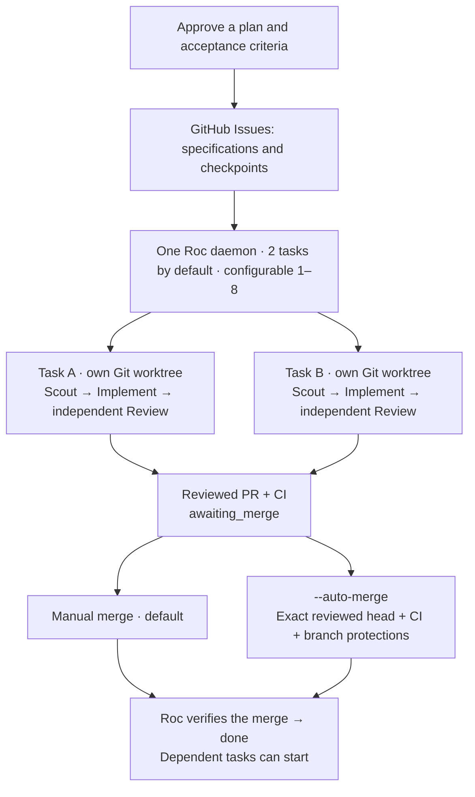

<p align="center">
  
</p>

[English](README.md) · [繁體中文](README.zh-HK.md)

# Roc

Turn approved GitHub Issues into independently reviewed pull requests.
One Roc daemon runs two tasks in separate worktrees by default. Merge manually,
or enable automatic merge after CI and branch-protection checks pass.

## How it works



[Interactive architecture map](output/archify/roc-current/roc-architecture.html) · [Full-size diagram](docs/assets/roc-architecture.png) · [Source-level architecture](docs/architecture.md).
The map is in English and links each component to the code at the documented revision.
Download the HTML and open it locally; GitHub displays its source.
See the [per-task workflow](README.details.md#per-task-workflow) for review and recovery paths.

- **GitHub holds task state.** Issues retain specifications, approvals, checkpoints and usage. PRs provide commit and merge evidence. There is no local SQLite task queue.
- **Roc coordinates; Pi executes.** The default flow is Scout → Implement → independent Review, with a separate Pi session per role. Explicitly approved low-risk tasks can omit Scout with `skipScout: true`.
- **Parallel work has boundaries.** Two tasks run by default; `--concurrency 1` through `8` sets the limit. Only disjoint scopes overlap. Ambiguous or overlapping scopes and tasks with hooks run alone. Run one daemon per repository.
- **An open PR is not done.** It stays `awaiting_merge` until Roc verifies the merge. An advanced base permits at most two clean rebases, each followed by fresh Review and CI.

### Read the task state

| State | Meaning | What to do |
| --- | --- | --- |
| `ready` | Approved work waiting for a slot, compatible scopes, or dependencies. | Keep the daemon running; check blockers in task details. |
| `scouting`, `implementing`, `reviewing` | Pi is working in the task's own worktree. | Watch `task board` and the daemon's task-tagged activity. |
| `awaiting_merge` | Review accepted the PR; its merge is not yet verified. | Merge it manually, or let `--auto-merge` wait for its required checks and approvals. |
| `done` | Roc verified the PR's merge into the target branch. | Dependent tasks may now start. |
| `needs_replan` | The recorded work needs a decision or repair before continuing. | Inspect the reason and follow the recovery guide; restarting alone does not resolve it. |

One operator runs the daemon. Teammates create and approve Issues, inspect
acceptance evidence, and review PRs in GitHub. The board reads shared checkpoints;
it does not launch another worker or grant approval.

New Codex setups select GPT-6 Astra; existing model settings are preserved.
New Scout/Review attempts use `high` reasoning; Implement uses `medium`.
Roc uses Pi's tools and agent loop. It does not launch Codex CLI or Claude Code.

Pi automatically summarizes older context as a session approaches its context
limit. Auto-compaction is enabled by default; Roc uses Pi's setting. See
[context compaction](README.details.md#context-compaction) and
[Pi's compaction documentation](https://github.com/earendil-works/pi/blob/main/packages/coding-agent/docs/compaction.md).

**Current status:** M1–M4 are complete for the revised scope, with real GitHub/GPT-6
sandbox acceptance. Physical two-host acceptance is deferred to [#56](https://github.com/devos-ing/Roc/issues/56);
Superset is outside this stage. [Validation and measurements](README.details.md#validation-status)
distinguish successful runs, failure recovery and unverified paths.
The commands below use this development checkout; do not assume the npm release has the same features.

## Quick start

You need Bun 1.3+, Node.js 22.19+, Git, GitHub CLI, and your project's build/test
tools. Tasks live in GitHub Issues. Run one execution daemon for the repository.

### 1. Set up Roc

Run `bun install` in this Roc checkout. Pi is included as a dependency.
Then enter the project you want Roc to modify. Replace the entrypoint with
this checkout's absolute path:

```bash
export ROC_CLI_ENTRY=/absolute/path/to/Roc/src/cli/main.ts
cd /path/to/your-project
gh auth login
bun "$ROC_CLI_ENTRY" onboard
```

Onboarding installs Roc's skills, lets you choose trusted skills and an Agile
cycle, and asks once for permission to run coding tools with your account's
permissions. It opens your browser for ChatGPT login when needed, tests a small
Codex prompt, and saves the model after a successful response. Existing Pi
credentials are reused. You do not need to install or log into Pi separately.
The test uses a small amount of your model quota.

Use ↑/↓ to move, Space to toggle skills, and Enter to confirm. Choose Daily,
Weekly (the default), or Custom and enter the number of days. Terminal colors
are automatic.

### 2. Create tasks through chat

Open the project in your usual coding assistant and ask:

```text
Use roc-create-tasks to add team invitations. Publish approved tasks to this repository's GitHub Issues using the Roc entrypoint in ROC_CLI_ENTRY.
```

The skill asks questions and proposes tasks with acceptance criteria. It saves
them to GitHub after you approve the complete plan. If the assistant cannot read your
terminal environment, give it the absolute Roc entrypoint path.
Install `grilling` and `unslop` in your planning assistant if missing; see
[planning skills](README.details.md#planning-skills).

If you already have an approved backlog JSON file, publish it directly:

```bash
bun "$ROC_CLI_ENTRY" task publish-github ./backlog.json
```

Task creation uses GitHub Issues. The old `task import` command and local SQLite
queue are no longer part of this workflow.

### 3. Start the daemon

In the same project and terminal, replace `main` with your target branch:

```bash
bun "$ROC_CLI_ENTRY" task list
bun "$ROC_CLI_ENTRY" scheduler run --base-branch main --concurrency 2
```

Leave the terminal open. Press `Ctrl-C` to stop. Restarting rereads saved
checkpoints; `needs_replan` or a retained lock requires [reconciliation](README.details.md#progress-and-recovery).
Roc keeps each task in `<project>.agile-worktrees/issue-<number>`.
For unattended work, use OS/container isolation because Pi has no built-in sandbox.

After configuring required CI, strict up-to-date checks and protection for administrators,
add `--auto-merge` to enable automatic merging. See [merge setup](README.details.md#optional-automatic-pr-merge).
Use `--concurrency 1` through `8` to choose the task limit; `--once` processes one task.

### 4. Follow progress

In another terminal, set the same `ROC_CLI_ENTRY`, enter the same project, and run:

```bash
bun "$ROC_CLI_ENTRY" task board
```

The board is read-only. Press `Enter` for details or `Q` to quit.
Colored columns show progress, attention, and completed work; the layout adapts
to your terminal width. Redirected output stays plain.
Details include elapsed time, attempt time, merge waiting, recent activity and incomplete usage.
Use `task acceptance <issue>` to read the original acceptance criteria and any
per-item automated Review evidence. It is read-only; human acceptance remains
separate.
When a task ends rejected, failed or retired, every task that depends on it
would wait forever. Point those dependents at a replacement task in the same
plan using `task supersede`:

```bash
bun "$ROC_CLI_ENTRY" task supersede 41 44
```

The command rewrites each dependent's dependency list onto the replacement
Issue, re-establishes the plan's trusted approvals and leaves a status comment
explaining the change. Run it signed in as a trusted publisher. It refuses
cross-plan supersede, terminal replacements and rewrites that would introduce a
dependency cycle; recovery stays an explicit operator action.
Watch the daemon terminal for individual live actions. GitHub saves summaries at phase boundaries,
with at most one extra activity update per 30 seconds.
Use `task list`, `scheduler inspect`, `tokens`, or `help` for more information.

## Go further

The [detailed guide](README.details.md) covers the architecture diagram, provider
setup, GitHub Issues as a shared task source, daemon deployment, and recovery.
You can publish from a MacBook and run the sole daemon on a Mac mini.
Physical two-host acceptance is deferred and remains unverified.

Development and releases: [CONTRIBUTING.md](CONTRIBUTING.md).
License: [Apache 2.0](LICENSE).
